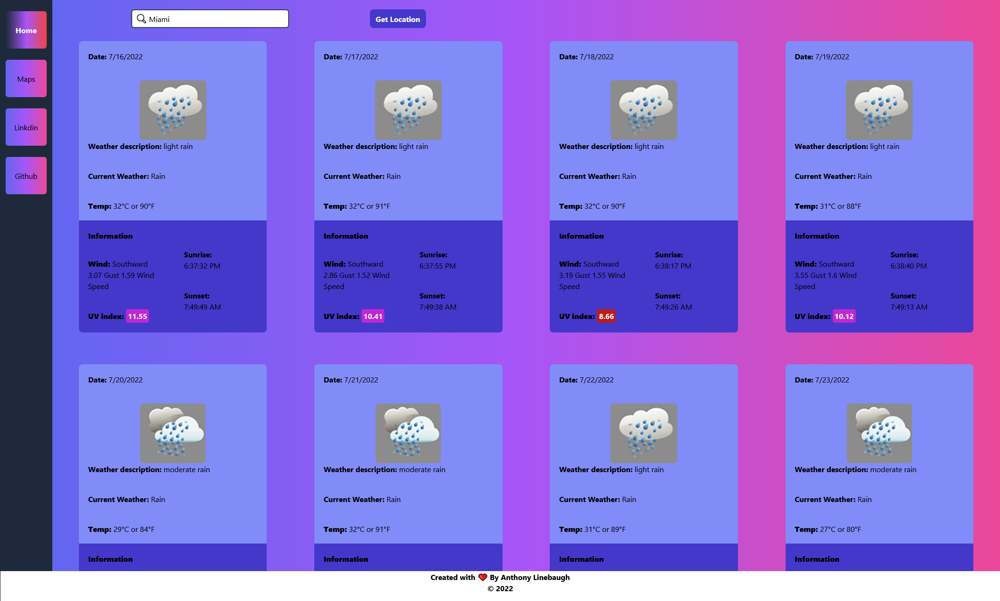

# React Weather Dashboard 

## Table of Contents

- [Description](#description)
- [URLs](#urls)
- [Usage](#usage)
- [Images](#images)
- [Credits](#credits)
- [License](#license)
- [Contributions](#contributions)
- [Questions](#questions)

## Description

An application that shows the weather for the day and the next 3 days. Can save other cities to toggle through as well. Other important information will be added about the day as well!

## URLs

GitHub repository: https://github.com/ajlineb/React-Weather

Webpage: https://ajlineb.github.io/React-Weather/

## Usage

This application will be helpful for users wanting accurate weather information for their day and the future with extra information regarding the day and fun animated weather icons.

## Images

## Credits

Open weather map for their api https://openweathermap.org/api

## License

MIT License

## Contributions

Reach out by email for additions to the webpage!

## Questions

Contact by:  
GitHub Username: [ajlineb](https://github.com/ajlineb)  
Email: anthonylinebaugh95@gmail.com
